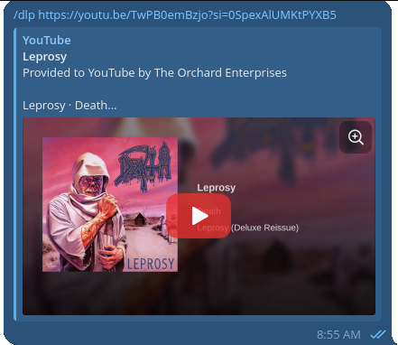
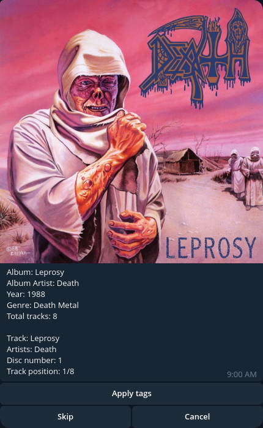
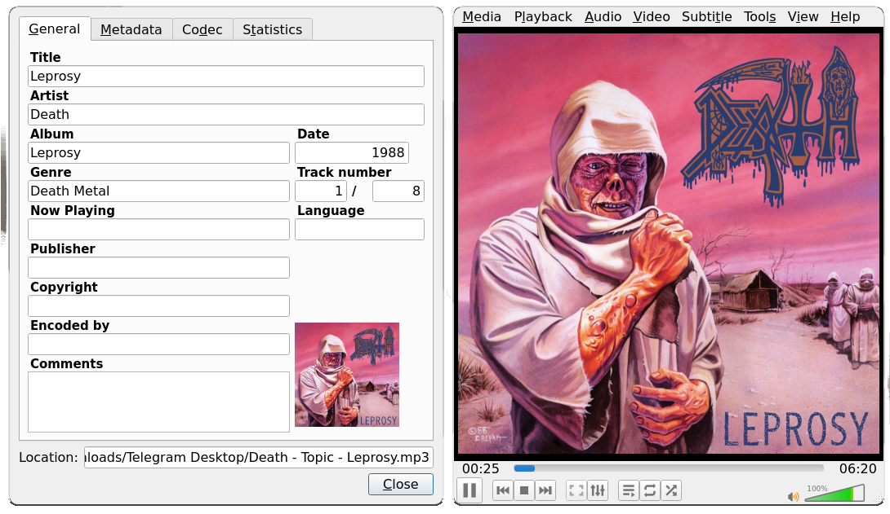

# Dandelion bot
Dandelion is a Telegram bot designed for downloading videos from YouTube, converting them to MP3, searching for matching track metadata, and applying ID3 tags directly to the audio files.

## How to use
First, make sure bot is running.
Copy the link of the video (music video, that contains title of the song, and its artist, either
in the name like "Death - Leprosy" or in the channel/uploader name) and pass it to bot using `/dlp <link>`.
The download should start.
<div align="center">
  
</div>

If the bot finds the track in the database, its response will look like this:

<div align="center">
  
</div>
Now you have to choose:

+ **`Apply tags`** - download the file with all the tags being written in it.
+ **`Skip`** - download the file without tags. Just raw .mp3 file.
+ **`Cancel`** - don't do anything, just remove the file.

Once you choose the **`Apply tags`** option, the file with all the tags shown to you will download.
Result may look like:
<div align="center">
  
</div>

> [!WARNING]
> **Disclaimer & Fair Use Notice**  
> This tool is developed strictly for educational and personal research purposes.  
> 
> * The developer does not encourage, condone, or support any unauthorized downloading, distribution, or reproduction of copyrighted material.
> * Users are solely responsible for complying with YouTube's Terms of Service, applicable copyright laws, and intellectual property rights in their jurisdiction.
> * The author of this repository accepts no liability or responsibility for any misuse of this application or any copyright violations committed by end users.

## Features
**Current:**
* Video download and automatic conversion to `.mp3`.
* Automated tag lookup via the Discogs API.
* Option to embed ID3 tags into the output file.

**In Development / Planned:**
* Downloading entire playlists as albums.
* Improved tag search accuracy.

## Installation
You'll need [Docker](https://www.docker.com/) and telegram account for launching the application.

First of all, just clone the repo on your PC.
```bash
git clone https://github.com/E1ecTro5/dandelion-bot.git
```
Inside the cloned folder, alongside the `main.py`, you'll need two additional files.

As for Telegram, you'll have to register an application on the official 
[Telegram API Development Tools](https://my.telegram.org/). You'll receive two variables called `APP_ID` and `API_HASH`. They will be needed in `.env` file, which you'll have to create inside
the cloned repository folder alongside the `main.py` file. The structure should be like this:
```env
TELEGRAM_API_ID=<your id>
TELEGRAM_API_HASH=<your hash>

YOUR_BOT_TOKEN=<your token>

BOT_API_URL=http://telegram-bot-api:8081
LOCAL_SERVER_URL=http://telegram-bot-api:8081
```

Next and last file you'll need to manually add to the folder is the `cookies.txt` file. Get it in your browser's extension market, it should be called like `"Get cookies.txt locally"`.
Enter `YouTube`, press on the plugin and download (export) the file. Note that you'll have to rename it, so it stays like `cookies.txt`.

## Launching
Since there is already a `docker-compose.yml` file, all you have to do is:
```bash
sudo docker compose build --no-cache
sudo docker compose up
```